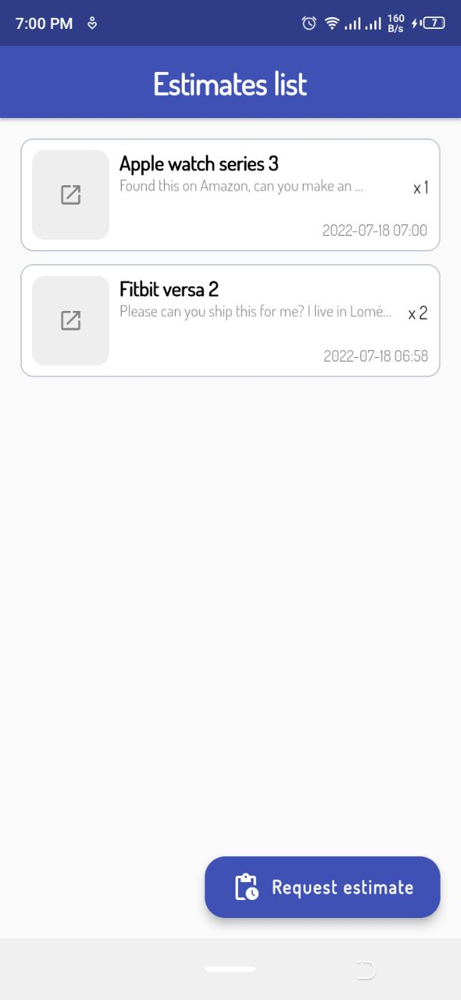
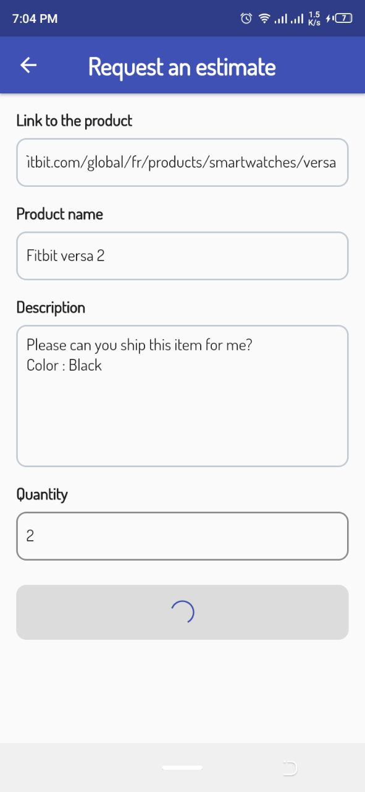

### Request an estimate App with riverpod and freezed

Simple Flutter App to showcase MVC+S pattern using riverpod and freezed package.

#### Backend : [Superbase](https://supabase.com/) REST API ([PostgREST](https://postgrest.org/))

#### Screenshots

| Home        | Submit    |
|--------------|-----------|
|  |       |

TODO:

* [x] Use freezed package
* [x] User authentication
* [ ] Details page
* [ ] Edit item
